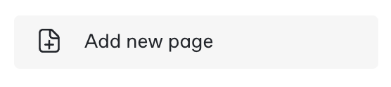

# Exercise 1: Pages and formatting

## Goal

Learn how to lay out sections/pages and common formatting in GitBook

## Pages

Throughout this guidebook, we'll be referring to sections and exercises. In GitBook, you create these using Pages. They appear on the left-navigation pane. This example has Getting started, several Exercises and a Challenge section.

## Creating a Page

1.  Click the Add new page button in the left nav

    <figure><figcaption></figcaption></figure>
2.  &#x20;Select New Document Page&#x20;

    <figure><figcaption></figcaption></figure>
3. Give your page a title and start adding content!

Pages can be dragged in the left-nav to re-order them or you can simply insert a new page by hovering on the space between pages and clicking the + button&#x20;

<figure><figcaption></figcaption></figure>

**Note:** for those familiar with our previous guidebook authoring process, H1 & H2 headings had special meaning and we used them to break up content into sections. In GitBook, Pages serve this function and you can use H1/H2/H3 headings as regular formatting elements.

## Common formatting

There's only a few formatting constructs you need to build a good looking guidebook:

* Ordered lists
* Images
* Links & Files
* Code blocks

### Ordered lists

1. Use ordered lists for task steps, this will be the bulk of your guidebook instructions.
2.  Sometimes you need a paragraph as part of your steps.

    Indent under the step and then you can insert paragraphs.&#x20;

    You can even have multiple paragraphs.
3. And continue on.
4. To add a paragraph under a numbered item, hit tab on a new line
5. Then hit delete to switch from a numbered sub-list to a paragraph

### Links & files

1.  To attach a file such as a spreadsheet or very long code block, type `/` on a new line and search for files

    <figure><figcaption><p>Insert file capture</p></figcaption></figure>
2.  Upload a new file or select an existing one

    <figure><figcaption></figcaption></figure>
3. The file gets added. That's all there is to it!

Links can be added anywhere by highlighting text and clicking the link menu option .  Links can be to external URLs, uploaded files or other headdings in your guidebook.

### Code blocks

For large pieces of code, file attachments are a better experience but for short snippets, inline code blocks are ideal.

1.  On a new line hit `/` and search for code block&#x20;

    <figure><figcaption><p>Code block search</p></figcaption></figure>
2. Paste in your code snippet
3.  Select the syntax highlight rule

    <figure><figcaption><p>Syntax highlight search</p></figcaption></figure>

```javascript
for(var i=0; i<10; i++) {
    helloWorld();
}
```

### Images

Adding an image to GitBook is as easy as copying and pasting. After pasting an image, you can click on it to bring up the format menu:  which allows you to set it as an inline image or a block, set the alt text for accessibility or swap it out for another image.

Here's some tips on images:

* Inline images must be smaller than 100 pixels wide.
* All images MUST have alternate text defined for accessibility compliance. This is the part of the image markdown in the square brackets. This text should describe the image in a way that allows a screen reader to provide context to someone who cannot see the image.
*   DO NOT use a screenshot as a replacement for text as this is not usable for people with accessibility requirements.

    For example, do not say “configure the record as shown \<insert screenshot>”. You can have a screenshot showing the configured record but you must also have text outside of the screenshot to explain what to do.
*   Screenshot images should have a border applied in : 1 pt, dark gray (hex #424242, dec 66,66,66) (This should be .75 px, but Snagit only supports integers and points, not pixels).

    [](https://github.com/ServiceNowEvents/GuidebookTemplate/raw/master/images/2019-10-10-10-46-35.png)
* Avoid entire screenshots when not needed

Keep in mind that many guidebook users may be viewing your content using mobile devices. Full screenshots are difficult to read on a tablet or mobile phone. For example, this image of Studio is difficult to read on a desktop, let alone a small screen.

**Bad**:

<figure><figcaption><p>Poor screenshot example</p></figcaption></figure>

Providing instructions to click _Create Application File_ are not much help. Instead, take a screenshot of the area of focus _in context_ (with some additional elements in the shot or partially in the shot) to help the viewer locate where you want them to focus.

**Good**:

[](https://github.com/ServiceNowEvents/GuidebookTemplate/raw/master/images/2019-10-11-08-43-59.png)

*   If you find you need a full screen shot...

    There will be times when you need an entire screenshot in your lab guide. Use these sparingly - often to show a "finished product" such as a dashboard layout.

    *   Make the font as large as possible

        Use your browser's zoom feature to make the font as large as possible without affecting the layout of the screen. This improves the readability.
    *   Use arrows to indicate areas of focus

        If you need to draw attention to a screen element in a larger context, use an arrow and label to clearly indicate where the reader should focus.


        <figure><figcaption></figcaption></figure>
* Do not exceed image width of 1024px
*   When you have an image representing multiple steps, provide numeric indicators and reference them in the text

    Example:

    1. In the left column, click **Data Model** (1), then in the middle, click **Table** (2), and finally click **Create** in the lower right (3).


    <figure><figcaption><p>Multiple step annotation</p></figcaption></figure>

## Other format objects

GitBook provides many different types of formats.  Explore and play, things like Tables and even API documentation formatters are available and very useful.

It is also possible to embed content from other services such as Figma or Google Docs. For our guidebooks you should avoid using these types of content blocks, in order for people to access those services, they need an account and/or you have to manage permissions. Lab guides are used throughout the year at other events and on-demand in Now Learning and the content within them needs to be publically accessible.


\


